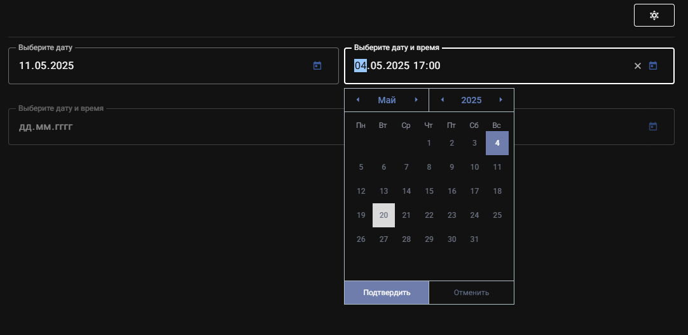

# Тестовое задание для AMICUM

## Краткое описание проекта
приложение с ключевым компонентом: ввод даты и времени. (`~/components/DateTimeInput.vue`)

на главной странице находится кнопка для переключения темы и 2 текстовых поля: в первом можно ввести дату, а во втором указать дату и время. 

оба поля поддерживают 2 варианта ввода: через календарь (открывается нажатием на иконку) и через ввод с клавиатуры.




[ссылка на ТЗ](https://www.figma.com/design/HTvNijthka0JxNP9pPZDbv/%D0%A2%D0%B5%D1%81%D1%82%D0%BE%D0%B2%D1%8B%D0%B5-%D0%B7%D0%B0%D0%B4%D0%B0%D0%BD%D0%B8%D1%8F?node-id=351-382)

## Технологический стек
приложение использует Nuxt в качестве фреймворка на базе Vue 3 с поддержкой TypeScript.

библиотека компонентов: Vuetify 3.

для сборки используется npm.

## Запуск на локальной машине
### скачиваем проект с github
```sh
git clone https://github.com/KirVelikiyy/lisov_AMICUM_test.git
```

### переходим в директорию проекта
```sh
cd lisov_AMICUM_test
```

### запускаем проект
```sh
npm i && npm run dev
```

## Впечатления от проекта 
на протяжении недели после работы я делал это тестовое задание. заняло оно больше времени, чем я изначально ожидал на него потратить. но мне понравилось, хорошая практика получилась

основной трудностью стала разработка календаря по дизайн макету. с нуля, переизобретая велосипед. я не нашел подхода или библиотеки, в которой бы это можно было полностью переопределить без боли. 

хотя возможно стоило присмотреться к https://ui.shadcn.com, обнаружил это лишь вчера.

интересной задачей стала борьба с стандарнтым календариком для поля типа date и datetime-local в Mozilla Firefox. дело в том, что в этом браузере нет доступных средств CSS, с помощью которых можно было бы удалить календарик. не за что подцепиться. а я искал. поэтому я просто закрыл этот календарик своим. 

## Что можно улучшить
я не сделал всё точь-в-точь как в дизайн макете. но в основном суть ясна. это конечно можно улучшить.

хочется декомпозировать код компонента DatePicker, так как там уже стало внушительное полотно в 400+ строк, что напрягало меня на финальных этапах разработки. не удобно листать туда-сюда файл в поиске нужного метода

можно также поработать над код-стайлом и неймингом переменных / функций / типов. в целом же я старался делать код чистым и понятным, добавлял в некоторые места комментарии, чтобы внести ясность почему так, а не иначе происходит

конечно еще хотелось бы реализовать логику для диапозона дат и времени. но на это нужно еще время, а я устал перерабатывать бесплатно. так что берите меня на работу и запилим все по красоте :)

ну и если я какое-то README до конца дочитываю то никогда не забываю поставить лайк написать комментарий типа братан хорош хорош контент в кайф можно вот этого вот почаще

